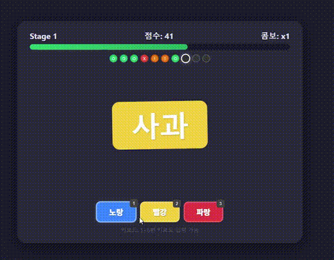

# 과일 스트룹 게임

과일 이름이 엉뚱한 배경색으로 나옴. 진짜 색깔 버튼 누르면 됨.

> "사과"가 파란 배경 → 사과는 빨간색 → **빨강** 클릭



## 규칙

- 10스테이지, 스테이지당 10문제
- 7개 이상 맞추면 다음 스테이지로 넘어감
- 스테이지 올라갈수록 제한시간 짧아짐 (5초 → 1.3초)
- 정답 +10, 오답 -5, 콤보 시 추가점수
- 버튼 위치랑 배경색 매번 바뀜

## 과일

| 과일 | 색 | 해금 |
|---|---|---|
| 사과 | 빨강 | 처음부터 |
| 바나나 | 노랑 | 처음부터 |
| 블루베리 | 파랑 | 처음부터 |
| 오렌지 | 주황 | Stage 3 |
| 수박 | 초록 | Stage 5 |
| 포도 | 보라 | Stage 7 |

## 실행

**웹** — `StroopFruitGame.html` 브라우저에서 열면 됨

**APK 빌드**
```bash
export ANDROID_HOME=/path/to/android-sdk
./gradlew assembleDebug
# app/build/outputs/apk/debug/app-debug.apk
```

## 조작

- 마우스 클릭 또는 키보드 `1`~`6`
- `Space`/`Enter`로 시작/재시작

## 기술

외부 라이브러리 없이 단일 HTML 파일로 동작함.

**렌더링**
- HTML5 + CSS3로 전체 UI 구성함. Canvas 안 씀
- CSS `animation`, `transition`으로 흔들림/페이드/펄스 효과 처리함
- 타이머 바는 `requestAnimationFrame`으로 매 프레임 width% 계산해서 갱신함
- 잔여시간 비율에 따라 초록→노랑→빨강 그라데이션 클래스 전환함

**게임 로직**
- Fisher-Yates 셔플로 버튼 위치 + 배경색 매 턴 랜덤 배치함
- 배경색이 자기 버튼 색과 겹치지 않도록 derangement 보정 로직 들어감
- 키보드 입력은 `buttonOrder[]` 매핑 배열로 셔플된 위치 → 실제 과일 인덱스 변환함
- 스테이지별 제한시간은 `STAGE_TIMES[]` 배열에 하드코딩함 (5.0, 4.5, 4.0, 3.5, 3.0, 2.5, 2.2, 1.9, 1.6, 1.3)
- 콤보 점수는 `baseScore(10) + (combo - 1) * 2`로 계산함

**사운드**
- Web Audio API의 `OscillatorNode` + `GainNode`로 효과음 런타임 생성함
- 정답음: sine파 880Hz→1100Hz→1320Hz 상승 톤, `exponentialRampToValueAtTime`으로 감쇠
- 오답음: square파 300Hz→200Hz 하강 톤
- 시간초과: triangle파 400Hz→300Hz→200Hz 3단 하강
- 스테이지 클리어: sine파 660→880→1100→1320Hz 4연속 상승

**데이터 저장**
- `localStorage`에 최고점수 저장함. 키는 `stroopHighScore2`

**안드로이드**
- `MainActivity.java`에서 `WebView` 하나 만들어서 `file:///android_asset/index.html` 로드함
- `setJavaScriptEnabled(true)`, `setDomStorageEnabled(true)`, `setMediaPlaybackRequiresUserGesture(false)` 설정함
- `SYSTEM_UI_FLAG_IMMERSIVE_STICKY`로 전체화면 유지함
- `onBackPressed()` 비워서 뒤로가기 오작동 방지함
- 빌드: Gradle 8.4, Android SDK 34, minSdk 24, Java 17
